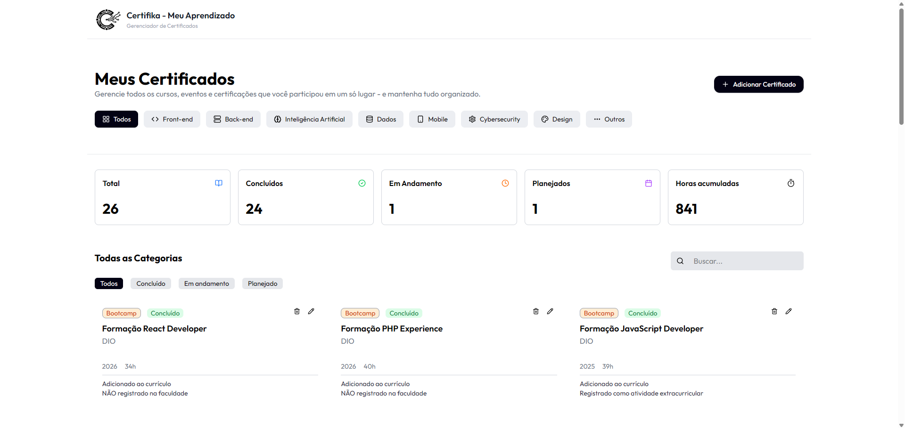

# Gerenciador de Certificados com React e Tailwind CSS

Aplicação desenvolvida para organizar certificados, cursos, e outras atividades acadêmicas e profissionais.

O projeto permite cadastrar, editar, excluir e filtrar certificados de forma simples e intuitiva, além de armazenar todas as informações localmente utilizando LocalStorage, garantindo que os dados permaneçam salvos mesmo após atualizar a página.

Durante o desenvolvimento foram aplicados conceitos importantes de React, como componentização, gerenciamento de estado com Hooks, passagem de propriedades (props), renderização dinâmica de listas, formulários controlados e persistência de dados.

O principal objetivo do projeto foi praticar o desenvolvimento de aplicações front-end modernas utilizando React e Tailwind CSS. E também para meu uso pessoal.

## Funcionalidades

- Cadastro de certificados
- Edição de certificados existentes
- Exclusão de certificados
- Busca por nome
- Filtro por status
- Filtro por categoria
- Persistência de dados com LocalStorage
- Interface responsiva
- Indicadores visuais 

---

## Tecnologias

- React
- Vite 
- JavaScript (ES6+)
- Tailwind CSS
- Git e GitHub
- [Google Fonts — Poppins](https://fonts.google.com/specimen/Poppins)

---

## 📁 Estrutura

```
gerenciador-certificados/
├── public/
├── src/
│   ├── assets/
│   ├── components/
│   │   ├── Header.jsx
│   │   ├── FiltersArea.jsx
│   │   ├── DashboardStats.jsx
│   │   ├── CertificationsList.jsx
│   │   ├── CertificationCard.jsx
│   │   ├── AddCertificationModal.jsx
│   │   └── Footer.jsx
│   ├── App.jsx
│   └── main.jsx
├── package.json
├── vite.config.js
└── README.md
```

---

## Preview


## Como rodar localmente

- Clone o repositório
git clone https://github.com/beatrizalmc/gerenciador-de-cursos-react

- Entre na pasta do projeto
cd gerenciador-certificados

- Instale as dependências
npm install

- Execute o projeto
npm run dev

- Após iniciar o servidor, acesse:
http://localhost:5173

---

## Aprendizados

Durante o desenvolvimento deste projeto foram praticados conceitos como:

* Componentização com React
* Gerenciamento de estado com useState
* Efeitos colaterais com useEffect
* Manipulação de formulários controlados
* CRUD completo (Create, Read, Update e Delete)
* Persistência de dados com LocalStorage
* Filtragem dinâmica de dados
* Busca em tempo real
* Responsividade utilizando Tailwind CSS
* Organização e reutilização de componentes

---

## Melhorias futuras

- Integração com banco de dados
- Upload de certificados
- Dashboard com gráficos

---

## 👩‍💻 Autora

Feito por **Beatriz Almeida** — estudante de Análise e Desenvolvimento de Sistemas pela UNOESTE.

[](https://www.linkedin.com/in/beatrizalmc)
[](https://github.com/beatrizalmc)
